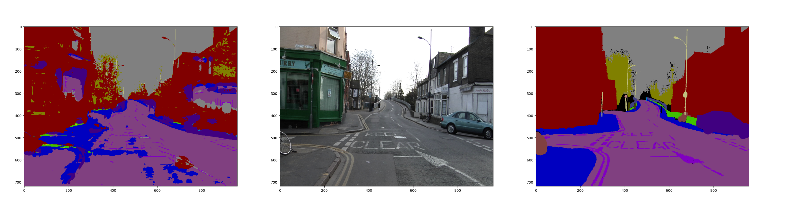

This code is an extensition of previous [Pytorch-Unet](https://github.com/milesial/Pytorch-UNet) work, which is designed one object segmentation. This code use [CamVid](http://mi.eng.cam.ac.uk/research/projects/VideoRec/CamVid/) dataset as an example to do multiple object segmentation. The current result is not good enough because I didn't spent a lot of time to adjust the network parameters. You can develop the code or redistribute it as you want. Also thanks to the [FCN](https://github.com/pochih/FCN-pytorch) for the `CamVid_utils.py` for parsing the data.  
Current result example  


# Environment
Pytorch 1.4  
CUDA 10.1
Python 3.7.4  
Pytorch > 1.0 CUDA > 7.0, Python> 3.0 should work

# Use
```
git clone https://github.com/zhaozhongch/Pytorch_UNET_MultiObjects.git
git clone https://github.com/PengKiKi/camvid
cd camvid
mv 701_StillsRaw_full ../Pytorch_UNET_MultiObjects/img_data
mv LabeledApproved_full ../Pytorch_UNET_MultiObjects/img_data
cd ../Pytorch_UNET_MultiObjects/img_data
python CamVid_utils.py
```
Get a coffee ans wait for `CamVid_utils.py` parsing the data. It will generate a folder with image mask, data type is numpy. The original dataset only has image and its corresponding 3 channel mask (a certain rgb color corresponding to an object). To train the dataset, we need a 1 channel mask that just showing is a pixel belong to a identity.  
The mask generated by `CamVid_utils.py` will have pixel level label. The dataset has totally 32 identities, if the `Animal`'s identity is 0 then all the numpy's value will be 0 if that pixel belongs to an animal.  
After finishing parsing the data
```
cd ..
python unet_train.py
```
It will generate a model at the current locaton `unet_model.pth`. Then run the `unet_val.py` to check the result. It will tell you the accuracy of each image prediction as well as showing the prediction 3 channel rgb mask.
```
python unet_val.py
```